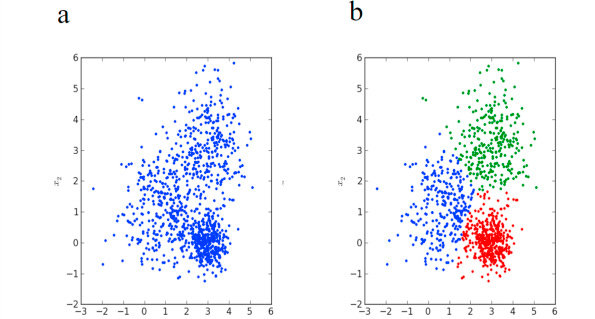
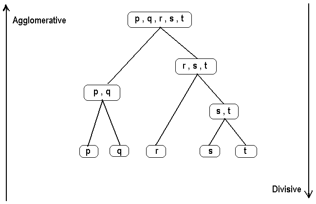

```{r setup, include=FALSE}
knitr::opts_chunk$set(echo = TRUE)
```

Also known as **hierarchical cluster analysis** is a method to group similar objects into groups called clusters in order to create structure in data. Most common clustering algorythm is K-means ( thank you Kang for the awesome intro lesson to come! ;) )

## Purpose

Allows visualisation of data to identify similarities and origin. Can compare relationships between sub clusters and data points.



<br>

## Types of hierarchial clustering

<br>

#### Agglomerative 

Also known as **bottom up** or **AGNES (Agglomerative Nesting),** it starts with individual observation and iterates upwards until only one data point remains which contains the full data set.

<br>

#### Divisive

Also known as **top down** or **DIANA (Divise Analysis),** has the opposite process of the agglomerative approach.

<br>



<br>

## Linkage

This is how we describe the relationships of data points within clusters. There four main types:

#### Single-Linkage

-   Shortest measured distance between one pair of observations in two separate clusters
-   Observations in different clusters can be closer than observations within the same cluster
-   Clusters can appear spread out
-   Also known as **nearest neighbor**

#### Complete-Linkage

-   Longest measured distance between one pair of observations in two separate clusters
-   Clusters appear tight but close together
-   Also known as **farthest neighbor**

#### Average-Linkage

-   Distance between each pair of observations in each cluster are summed then divided by total number of pairs

#### Centroid-Linkage

-   Distance between centroids of two clusters
-   With new observations, centroid will move which may cause an inversion of the dendrogram

<br>


## Hierarchial Clustering in R

Packages used: 

- `library(cluster)`
- `library(factoextra)`
- `library(dendextend)`

Call used:

- `hclust()` for a dendrogram
- `as.dendrogram()` ''
- `rect.hclust()` creates a rectangle visual around dendrogram for better interpretation